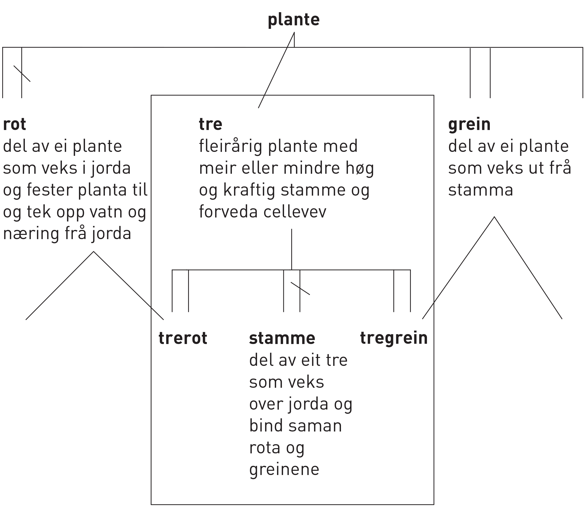
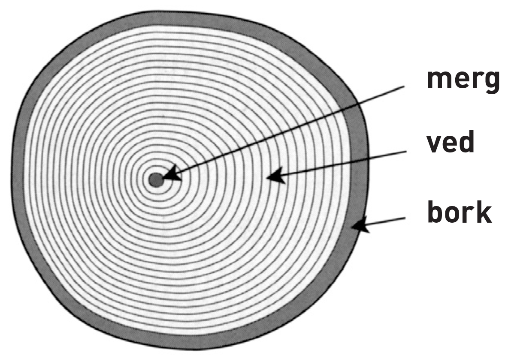

== 2 Definisjonar [[kap2]]

Kvaliteten på eit terminologiarbeid avheng hovudsakleg av kvaliteten på definisjonane.

Ein definisjon skal gjelde _berre eitt_ omgrep. Dersom ein term står for fleire enn eitt omgrep på det fagområdet som blir handsama, skal det gjerast greie for desse omgrepa i særskilde termpostar i ordlista (sjå òg <<kap6.2, 6.2>>).

Definisjonane skal vere skrivne på ein slik måte at omgrepa står på rett plass og er høveleg skildra i sine respektive omgrepssystem. Før ein tek til å skrive sjølve definisjonen, er det difor nødvendig å identifisere

[loweralpha]
. dei omgrepa i det aktuelle omgrepssystemet som er nær knytte til kvarandre
. dei relasjonstypane som ligg føre mellom omgrepa

I figur 4, 5 og 7 er det døme på definisjonar som byggjer på ulike typar omgrepsrelasjonar.

=== 2.1 Typar definisjonar [[kap2.1]]

I fagordlister kan omgrepa definerast med hjelp av

* *innhaldsdefinisjonar*, som skildrar dei vesentlege og åtskiljande kjenneteikna til omgrepet
* *omfangsdefinisjonar*, som reknar opp dei referentane som omgrepet dekkjer

==== 2.1.1 Innhaldsdefinisjonar [[kap2.1.1]]

Når ein skriv definisjonar, er det vanlegast å rekne opp dei åtskiljande kjenneteikna til omgrepet. Alle omgrep har ei rekkje kjenneteikn, og skulle vi rekne opp alle saman, ville definisjonen bli uforståeleg. Difor byggjer ein innhaldsdefinisjon alltid på eit generisk overomgrep som dekkjer dei grunnleggjande vesentlege kjenneteikna og plasserer omgrepet i rett samanheng blant liknande omgrep (_tre_ blant _planter_, _papirmaskiner_ blant andre _maskiner_ osv.). Resten av definisjonen omfattar dei åtskiljande kjenneteikna som må vere med for å skilje dette omgrepet frå andre nærståande omgrep.

[grid=none]
|===
|Døme:
a|
[no-bullet]
*  *lyskrevjande tre* +
  tre som treng mykje lys

* *skuggetre* +
tre som trivst best i skugge

* *edelgass* +
einatomig gass som berre sjeldan er med i kjemiske sambindingar
|===

Det er fleire døme i definisjonane i figur 4, 5 og 7.

==== 2.1.2 Omfangsdefinisjonar [[kap2.1.2]]

Omfangsdefinisjonar reknar opp dei referentane som er dekte av det omgrepet som skal definerast (sjå <<kap1.3, 1.3>>).

[grid=none]
|===
|Døme:
a| [no-bullet]
* *edelgass* +
helium, neon, argon, krypton, xenon, radon eller ununoctiumfootnote:[Legg merke til at formuleringa «helium, neon, argon, krypton, xenon, radon og ununoctium» gjev definisjonen for gruppe 18 i «det periodiske systemet» for grunnstoff, dvs. heile gruppa av edelgassar.]
|===

Sjå òg definisjonen av _bartre_ under <<kap2.5.3.3, 2.5.3.3>>.

==== 2.2 Systematisk definisjon [[kap2.2]]

For at kommunikasjonen skal vere tydeleg, må omgrepa og relasjonane og skilnadene mellom dei vere eintydig skildra. Når ein skal skrive ein definisjon, er det difor viktig å vite korleis omgrepet passar inn i det aktuelle omgrepssystemet.

I generiske omgrepssystem byggjer innhaldsdefinisjonen alltid på det næraste overomgrepet. Deretter blir åtskiljande kjenneteikn valde ut for å vise relasjonane mellom over- og underomgrepa og mellom sideomgrepa.

[grid=none]
|===
|Døme:
a| [no-bullet]
* *tre* +
fleirårig plante med meir eller mindre høg og kraftig stamme og forveda cellevev

* *bartre* +
tre med nåle- eller skjelforma blad og nakne frø

* *gran* +
bartre av slekta Picea
|===

I partitive omgrepssystem kjem ein relasjon mellom overomgrepet og underomgrepet til syne berre i definisjonen av eit av desse omgrepa (sjå òg <<kap2.5.3.2, 2.5.3.2>>).

[grid=none]
|===
|Døme:
a|
. *saks* +
[no-bullet]
* klippereiskap som har to saksblad som er føydde saman på midten og dannar ei X-form når dei blir opna, og klipper når dei går saman
[no-bullet]
** *saksblad* +
flatt blad av metall som har egg på den eine sida og ringforma handtak for finger i den eine enden

. *år* +
[no-bullet]
tidsrom som (meir eller mindre nøyaktig) svarer til krinsløpet til jorda rundt sola
[no-bullet]
** *årstid* +
del av år som er karakterisert ved vêr-, vekst- og naturforhold av same slaget
|===

Når det ligg føre ein assosiativ relasjon, tek innhaldsdefinisjonen vanlegvis til med ein generell term som står for eit generisk overomgrep (sjå òg <<kap2.1.1, 2.1.1>>), og deretter kjem kjenneteikna som viser den relevante assosiative relasjonen.

[grid=none, cols="1,1,5,1,5"]
|===
|Døme:||||
||1|*ved*|←|*vedkasse*
|||trevyrke til brensel||behaldar til *ved*
||2|*tømmer*|←|*tømmerhus*
|||trestammer til byggjevyrke eller foredling||hus bygd av tømmer
||3|*fyrstikkvyrke*|→|*fyrstikk*
|||rundvyrke til framstilling av *fyrstikker*||trestikke med tennsats som fatar ved gniding
|===

=== 2.3 Kor nøyaktig skal definisjonen vere? [[kap2.3]]

Definisjonar skal vere så kortfatta som mogeleg. Definisjonar som er skrivne med omtanke, skal innehalde berre dei opplysningane som trengst for å plassere omgrepet riktig i omgrepssystemet.  Alle tilleggsopplysningar og døme bør stå i ein merknad. Slike tilleggsopplysningar kan til dømes vere viktige kjenneteikn som ikkje er vesentlege, eller ei opprekning av typiske referentar som omgrepsomfanget omfattar.

[grid=none]
|===
|Døme:
a| [no-bullet]
* *eviggrønt tre* +
tre som held på blada sine sjølv i den kalde årstida på dei breiddegrader der slike årstider kjem regelmessig, men som kan misse blada sine i arktisk klima, eller tre som veks i eit klima der det ikkje er skiftande årstider

* _Skriv heller_:
* *eviggrønt tre* +
tre som held på blada sine heile året +
MERKNAD: Det er klimaet som avgjer om eit tre held på blada sine og dermed kan klassifiserast som eviggrønt.
|===

=== 2.4 Utskiftingsprinsippet [[kap2.4]]

I tekstar kan termar og definisjonar skiftast ut med kvarandre. Det inneber at ein term om nødvendig skal kunne skiftast ut (med små endringar) med definisjonen sin. For å avgjere om ein definisjon er korrekt eller ikkje, kan ein gjere ei utskiftingsprøve. Det gjer ein ved å byte ut termen med definisjonen av termen i til dømes ein annan definisjon.

=== 2.5 Feilaktige definisjonar [[kap2.5]]

Dei vanlegaste feilaktige definisjonane er sirkeldefinisjonar, negative definisjonar og mangelfulle definisjonar. Fleire opplysningar om andre typar feilaktige definisjonar kan ein få frå røynde terminologar eller finne i handbøker om terminologi.

==== 2.5.1 Sirkeldefinisjonar [[kap2.5.1]]

Ein sirkeldefinisjon oppstår når vi definerer eit omgrep med omgrepet sjølv, direkte eller indirekte. Av den grunn gjev ikkje ein sirkeldefinisjon oss auka kunnskap om omgrepet. Det er to typar sirkeldefinisjonar:

* indre sirkeldefinisjon, det vil seie ein sirkel innanfor ein og same definisjon
* ytre sirkeldefinisjon, det vil seie ein sirkel innanfor eit omgrepssystem

Ein definisjon går i sirkel innanfor ein og same definisjon når omgrepet blir nytta som overomgrep (døme 1) eller som eit av kjenneteikna i definisjonen (døme 2).

[grid=none]
|===
|Døme:
a|
. *trehøgd* +
*trehøgd* målt frå bakken til toppen av treet +
[no-bullet]
_Skriv heller_:
[no-bullet]
*trehøgd* +
avstanden frå bakken til toppen av treet

. *eviggrønt tre*
tre som er *eviggrønt*
[no-bullet]
_Skriv heller_:
[no-bullet]
*eviggrønt tre* +
tre som held på blada sine heile året
|===

Det ligg føre ein sirkeldefinisjon innanfor eit omgrepssystem om to eller fleire omgrep blir definerte med hjelp av kvarandre.

[grid=none]
|===
|Døme:
a| [no-bullet]
* *nedstraums* +
i omvend retning av oppstraums

* *oppstraums* +
i omvend retning av nedstraums
[no-bullet]
_Skriv heller_:
[no-bullet]
*nedstraums* +
i retning med straumen
|===

Definisjonen av oppstraums kan likevel stå som han er, sidan han tydeleggjer at oppstraums høyrer saman med nedstraums.

==== 2.5.2 Negative definisjonar [[kap2.5.2]]

Ein definisjon skal vanlegvis skildre kva eit omgrep er, ikkje kva det _ikkje_ er. Likevel er det nokre omgrep som krev ein negativ definisjon, sidan fråværet av visse kjenneteikn er vesentleg for omgrepet.

[grid=none]
|===
|Døme:
a|
. Negativ definisjon som ikkje kan godtakast:
[no-bullet]
*sommargrønt tre* +
tre som ikkje er eviggrønt
[no-bullet]
_Skriv heller_:
[no-bullet]
*sommargrønt tre* +
tre som feller blada før vinteren

. Negativ definisjon som kan godtakast:
[no-bullet]
*fleinskalla* +
som ikkje har hår på hovudet
|===

I prinsippet skal ein uttrykkje kjenneteikn positivt. I visse tilfelle kan likevel eitt av fleire kjenneteikn innehalde eit negativt uttrykk, til dømes om det er vesentleg, ein språkleg konvensjon eller fast etablert.

==== 2.5.3 Mangelfulle definisjonar [[kap2.5.3]]

Ein definisjon skal vere nøyaktig. Han skal korkje vere for vid eller for trong.

===== 2.5.3.1 For vide definisjonar [[kap2.5.3.1]]

Ein definisjon er for vid om han ikkje gjev dei vesentlege opplysningane som trengst for å avgrense det aktuelle omgrepet tydeleg.

[grid=none]
|===
|Døme:
a| [no-bullet]
* Definisjonen av _tre_ nedanfor er for vid fordi han ikkje seier at ei plante mellom anna må ha ei meir eller mindre høg og kraftig stamme for å vere eit tre. Med denne definisjonen vil både bananplanta og vinranka vere eit tre, noko dei ikkje er.

[no-bullet]
* *tre* +
fleirårig høg plante
|===

===== 2.5.3.2 For tronge definisjonar [[kap2.5.3.2]]

Ein definisjon er for trong om han tek med kjenneteikn som ikkje høyrer til omgrepet, og som utilsikta stengjer ute referentar som omgrepet burde omfatte.

[grid=none]
|===
|Døme:
a| [no-bullet]
* Definisjonen av _bartre_ nedanfor er for trong fordi han stengjer ute sommargrøne bartre som lerk, kjempegran og sumpsypress. Den korrekte definisjonen bør ikkje innehalde kjenneteiknet _eviggrøn_. Det rette overomgrepet er difor tre (sjå definisjonen under <<kap2.2, 2.2>> [.line-through]#på side 25#).

[no-bullet]
* *bartre* +
eviggrønt tre med nåle- eller skjelforma blad og nakne frø
|===

Ein for trong definisjon oppstår vanlegvis når eit omgrep som er i allmenn bruk, blir definert som om det berre høyrer til eit særskilt fagområde.

[grid=none]
|===
|Døme:
a| [no-bullet]
* For trong definisjon:
[no-bullet]
* *fertilitet* +
den evna eit *tre* har til å formeire seg
[no-bullet]
* _Skriv heller_:
[no-bullet]
* *fertilitet* +
evne til å formeire seg

|Døme:
a| [no-bullet]
* For trong definisjon i ein partitiv relasjon:
[no-bullet]
* *kvist*
grunnleggjande byggjeelement i skjorereir
|===

Når omgrep som er i allmenn bruk, blir definerte som om dei berre høyrer til eit særskilt fagområde, blir det vanskelegare å nytte definisjonar frå andre termlister, og det fører til dobbeltarbeid. Sidan terminologiarbeid er kostbart, bør grupper som arbeider på nærskylde fagområde, unngå å definere dei same omgrepa kvar for seg.

I somme tilfelle kan det likevel vere nødvendig å avgrense definisjonen til eit særskilt fagområde. Då bør fagområdet stå i vinkelparentes føre definisjonen.

[grid=none]
|===
|Døme:
a| [no-bullet]
* Rett formulering:
[no-bullett]
* *bløding* +
<botanikk> utskiljing av væske frå levande del av plante gjennom
sår i overflata
|===

Eit partitivt underomgrep bør definerast som _del av ..._ berre dersom det einast finst som ein del av heilskapen som blir nemnd i definisjonen.

Allmenne omgrep som rot, grein, blad, skrue, brytar, hjul og liknande må ikkje definerast som om dei berre er ein del av ein særskild referent eller ein særskild type referentar.

.Partitivt omgrepssystem i praksis

I praksis blir definisjonane i *omgrepsdiagrammet* i figur 5 skrivne slik at dei følgjer diagrammet i figur 8.

===== 2.5.3.3 Ufullstendige omfangsdefinisjonar [[kap2.5.3.3]]

Ein omfangsdefinisjon skal rekne opp alle referentane som inngår i omfanget til eit omgrep. Formuleringar som_ t.d., følgjande_ eller _o.l. _blir ikkje godtekne. Ei ufullstendig opprekning av referentar kan likevel takast med i ein merknad til definisjonen.

[grid=none]
|===
|Døme:
a| [no-bullet]
* *bartre* +
vanlege typar bartre er seder, sypress, einer, furu, gran, kjempegran, lerk og pinje
* _Skriv heller_:
* *bartre* +
tre med nåle- eller skjelforma blad og nakne frø +
MERKNAD: Vanlege typar bartre er seder, sypress, einer, furu, gran, kjempegran, lerk og pinje.
|===

==== 2.5.4 Skjulte definisjonar inne i definisjonar [[kap2.5.4]]

Ein definisjon skal omfatte berre eitt omgrep. Dersom ein term viser til fleire enn eitt relevant omgrep på det aktuelle fagområdet, skal han ha fleire termpostar.

Andre termar enn den som står for det omgrepet definisjonen gjeld, skal ikkje forklarast inne i definisjonen. Ein definisjon skal berre vise til omgrep som er kjende for dei som skal bruke definisjonen, eller som er definerte andre stader i termlista. Alle omgrep som krev forklaringar, skal definerast i eigne termpostar.

[grid=none]
|===
|Døme:
a| [no-bullet]
* Den følgjande definisjonen av tre inneheld ein skjult definisjon av grein:

* *tre* +
fleirårig plante med meir eller mindre høg og kraftig stamme og forveda cellevev og greiner, *dvs. delar som veks ut frå stamma*
|===

Om det er nødvendig å definere grein, bør det gjerast i ein eigen termpost.

=== 2.6 Figurar [[kap2.6]]

Ein kan bruke illustrasjonar for å utfylle definisjonane, ikkje for å avløyse dei. Om ein nyttar illustrasjonar, skal dei helst stå på same sida som den termposten dei høyrer til.

[grid=none]
|===
|Døme:
a| [no-bullet]
* *merg* +
sentralt, laust cellevev i stamma hos visse planter +
Sjå figur 9.
a| .Merg

|
|===
