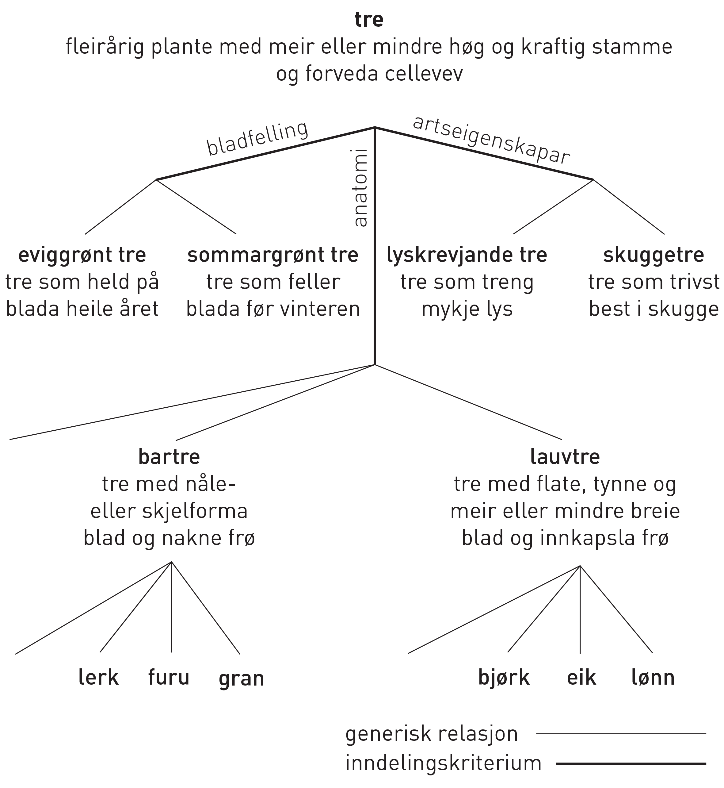
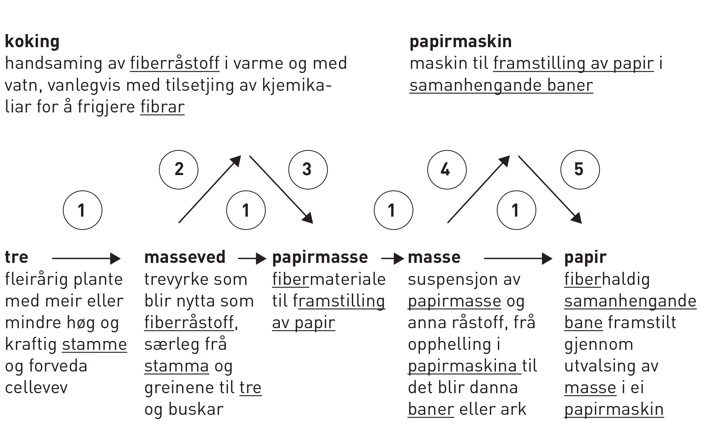

== 1 Omgrepsanalyse [[kap1]]

[frame=none]
|===
|Terminologiarbeid er ei tverrfagleg verksemd som går ut på å ordne og overføre kunnskap. Det grunnleggjande elementet i arbeidet er omgrepet. Alt terminologiarbeid skal byggje på at omgrepa og relasjonane mellom dei blir analyserte og strukturerte.
{set:cellbgcolor:#DAE3F3}
|===
{set:cellbgcolor!}

=== 1.1 Tilhøvet mellom referent, omgrep, definisjon og term [[kap1.1]]

I den verkelege verda er det millionar av fenomen, eller det vi kallar *referentar*. Nokre av dei er konkrete (t.d. tre, innretningar og mate­ riale), andre er abstrakte (t.d. samfunn og helse).

Når vi tenkjer på ein referent, til dømes eit tre, vel vi i medvitet vårt ut ei rekkje eigenskapar som vi synest best kjenneteiknar referenten. I hovudet vårt blir desse eigenskapane til abstraksjonar som vi kallar *kjenneteikn* (sjå <<kap1.2, 1.2>>). Kjenneteikna blir deretter slegne saman slik at dei dannar ei kunnskapseining som vi kallar *omgrep*.

[grid=none]
|===

a| Omgrepet _tre_ har mellom anna følgjande kjenneteikn: _fleirårig plante_, _har meir eller mindre høg og kraftig stamme_, _har forveda cellevev_, _har greiner_, _har røter_ footnote:[I _Norsk landbruksordbok_, band I (Det Norske Samlaget, Oslo 1979) er _tre_ definert slik:
pass:p[ +]
pass:p[ +]
*vedplante* med meir el. mindre høg og kraftig stamme, og greiner som går ut frå denne og ber kvister med blad (nåler), blomstrar og frukter
pass:p[ +]
pass:p[ +]
Same staden er _vedplante_ definert slik:
pass:p[ +]
fleirårig plante med skott der storparten av stengelen (stamma) er bygd opp av *ved*
pass:p[ +]
pass:p[ +]
_Ved_ er definert slik:
pass:p[ +]
forveda (lignifisert) cellevev i røter, stamme og greiner]
|===

Eit omgrep som berre er knytt til ein einaste referent, kallar vi eit *individualomgrep* (t.d. _planeten Jupiter, Eiffeltårnet_). Når vi tenkjer på fleire einsarta referentar, trekkjer vi ut dei eigenskapane som alle desse referentane har felles, og set dei saman som kjenneteikn for eit *allmennomgrep* (t.d. _planet_, _tårn_). Omgrep er abstraksjonar, og for at vi skal kunne kommunisere om dei, treng vi definisjonar og termar for å uttrykkje dei. *Definisjonar* er munnlege eller skriftlege ut­segner som avgrensar omgrep, og *termar* er uttrykk som set namn på omgrep. Eitt eller fleire ord eller andre element, til dømes symbol, kan utgjere ein term.

I figur 1 er elementa i grunnplanet til pyramiden (referentar, termar og definisjonar) konkrete eller abstrakte fenomen i den verkelege verda eller uttrykk i eit språk. Omgrepa, som er plasserte i toppen av pyramiden, er mentale førestellingar. For at vi skal kunne snakke om dei, må vi bruke fastsette uttrykk, det vil seie termar eller definisjon­ ar som viser til dei. For meir detaljerte opplysningar om omgreps­ analyse, sjå ISO 704.

.Tilhøvet mellom referent, omgrep, definisjon og term
image::images/Fig1.png[width=400, pdfwidth=50vw]

=== 1.2 Kjenneteikn [[kap1.2]]

Kjenneteikn svarer til eigenskapar knytte til referentar. Kvart omgrep har vanlegvis ei mengd kjenneteikn. Mange av dei er så vanlege at dei ikkje eignar seg når vi skal identifisere eit omgrep, eller når vi skal skilje det frå andre omgrep. (Både tre og syklar er _konkrete_ og _harde_ og kan vere _grøne_.) *Åtskiljande kjenneteikn* er dei kjenneteikna som åleine eller saman med andre kjenneteikn avgrensar omgrepet og skil det frå andre omgrep. I definisjonar er det berre åt­skiljande kjenneteikn som skal nyttast.

[grid=none]
|===
|Til dømes er _har meir eller mindre høg og kraftig stamme_ eit åtskiljande kjenneteikn for tre når vi samanliknar dei med klatrande planter. Derimot har alle planter, tre òg, røter, og difor er kjenneteiknet _har røter_ ikkje eit åtskiljande kjenneteikn for tre.
|===

=== 1.3 Omgrepsinnhald og omgrepsomfang [[kap1.3]]

Innhaldet til eit omgrep er alle dei kjenneteikna som utgjer om­ grepet. (Omgrepsinnhaldet til _tre_ omfattar til dømes kjenneteikna _fleirårig plante_, _har meir eller mindre høg og kraftig stamme_, _har grein­er_.) Omfanget til eit omgrep er alle dei referentane som omgrepet dekkjer. (Omgrepsomfanget til _tre_ omfattar alle furutre, grantre, bjørketre, eiketre, epletre og liknande, men ikkje slektstreet!) Både *omgrepsinnhald* og *omgrepsomfang* kan nyttast til å definere omgrep (sjå <<kap2.1, 2.1>>).

=== 1.4 Omgrepssystem [[kap1.4]]

Omgrep er ikkje uavhengige. Dei er alltid knytte til andre omgrep på ein eller annan måte, og dei dannar *omgrepssystem* som kan variere frå ganske enkle til svært komplekse. For at ein skal lukkast med å skrive definisjonar i terminologiarbeid, må ein analysere relasjona­ne mellom omgrepa og setje dei opp i omgrepssystem.

Omgrepssystem blir klassifiserte etter kva typar relasjonar som finst mellom omgrepa. I all hovudsak skil vi mellom tre typar relasjonar: *generiske*, *partitive* og *assosiative*. I praksis arbeider vi ofte med ein kombinasjon av desse relasjonstypane (blanda omgrepssystem).

==== 1.4.1 Generiske relasjonar og omgrepssystem [[kap1.4.1]]

Det ligg føre ein generisk relasjon når to omgrep deler ei identisk mengd kjenneteikn, men eit av omgrepa, *underomgrepet*, har minst eitt åtskiljande kjenneteikn i tillegg. (Om til dømes _tre_ er *overomgrepet*, vil _bartre_ vere eit underomgrep med _har nåler_ og _er ein na­kenfrøa plante_ som åtskiljande kjenneteikn.) Underomgrepet har eit mindre omgrepsomfang (sjå <<kap1.3, 1.3>>) enn overomgrepet. (Det finst med andre ord færre bartre enn det finst tre.)

Eit generisk omgrepssystem byggjer på dei generiske relasjonane mellom omgrepa. Overomgrepet er delt inn i fleire underomgrep. Det generiske omgrepssystemet har ofte fleire nivå. Eit underomgrep kan vere overomgrep for ei anna mengd underomgrep og så vidare. (Til dømes kan bartre delast inn i _gran_ og _furu_.) Sjå figur 2.

.Generisk omgrepssystem for _tre_
image::images/Fig2.png[width=500, pdfwidth=60vw]

Eit omgrep kan delast inn i underomgrep på fleire måtar. Underinndelinga av tre kan til dømes byggje på følgjande kriterium:

* anatomi (figur 2: _bartre_, _lauvtre_)
* artseigenskapar (figur 3: _lyskrevjande tre_, _skuggetre_)
* bladfelling (figur 3: _sommargrønt tre_, _eviggrønt tre_)

Underomgrep som er sette opp ved sida av kvarandre etter same inndelingskriterium, blir kalla *sideomgrep*. I figur 3 er til dømes _lyskrevjande tre_ og _skuggetre_ sideomgrep, medan _lyskrevjande tre_ og _sommargrønt tre_ ikkje er det.

.To generiske omgrepssystem for _tre_, med ulikt inndelingskriterium
image::images/Fig3.png[width=500, pdfwidth=60vw]

Underinndelingane i figur 3 er parallelle og uavhengige av kvarandre og kan sjåast som underinndelingar av eit omgrep etter to ulike inndelingskriterium. I terminologiarbeid kan desse underinndelingane handsamast som åtskilde omgrepssystem med same overomgrep. Det er likevel ofte enklare å skjøne mangfaldet i omgrepsrelasjonar dersom omgrepa er slegne saman slik at dei dannar eitt omgrepssystem med fleire inndelingskriterium (sjå figur 4).

Når eit omgrepssystem blir framstilt i eit trediagram, kan inndelingskriteria skrivast langs linene for underinndelingane.

.Generisk omgrepssystem for tre, med fleire inndelingskriterium

==== 1.4.2 Partitive relasjonar og omgrepssystem [[kap1.4.2]]

Det ligg føre ein partitiv relasjon når overomgrepet er knytt til referenten som eit heile og underomgrepa er knytte til delar av denne heilskapen (t.d. eit tre og delane av det: stamme, greiner, røter o.a.).

Partitive omgrepssystem kan framstå på mange måtar. Dei delane som utgjer heilskapen, kan alle vere like (som dei to oksygenatoma som utgjer eit oksygenmolekyl) eller ulike (som dei fire årstidene som utgjer eit år). I nokre tilfelle er talet på delar avgjerande (to oksygenatom dannar eit oksygenmolekyl, tre oksygenatom dannar eit ozonmolekyl), andre gonger er det ikkje avgjerande (ein stol kan ha frå eitt til fire eller fleire bein). Heilskapen kan vere eit lukka system med visse delar (eit år) eller eit ope system som tillet at fleire delar kan takast med (elektrisk utstyr er ein heilskap som omfattar minst eitt elektrisk apparat).

.Partitivt omgrepssystem for tre
image::images/Fig5.png[width=500, pdfwidth=60vw]

Figur 5 viser eit partitivt omgrepssystem som er metodisk og korrekt sett opp. I praksis ville nok ikkje uttrykka _trerot_ og _tregrein_ bli førde opp som termar i ei termliste for tre. Dei ville bli bytte ut med _rot_ og _grein_, som viser til meir allmenne omgrep. Meir om dette under <<kap2.5.3.2, 2.5.3.2>> og i figur 8.

På same måten som generiske omgrepssystem kan partitive omgrepssystem ha fleire nivå og inndelingskriterium (sjå figur 6).

.Partitivt omgrepssystem for tre, med fleire inndelingskriterium
image::images/Fig6.png[width=500, pdfwidth=60vw]

==== 1.4.3 Assosiative relasjonar og omgrepssystem [[kap1.4.3]]

Assosiative relasjonar dekkjer ei lang rekkje ikkje-hierarkiske relasjonar, til dømes:

* årsak/verknad (_vår / det kjem lauv på trea_)
* produsent/produkt (_skjor / eit skjorereir_)
* aktivitet/aktør (_bygging av reir / fugl_)
* aktivitet/stad (_bygging av reir / tre_; _papirproduksjon/papirfabrikk_)
* føremål/stad (_reir/tre_; _papirmaskin/papirfabrikk_)
* føremål/aktivitet (_epletre/fruktplukking_)
* verkty/funksjon (_papirmaskin/papirproduksjon_)
* materiale/produkt (_trevyrke/papir_)

Dei assosiative relasjonane mellom omgrepa i eit omgrepssystem kan variere (sjå figur 7).

.Assosiativt omgrepssystem

Relasjonar:

. opphav → produkt
. råstoff → prosess
. prosess → produkt
. råstoff → maskin
. maskin → sluttprodukt

Dei understreka orda i figuren viser korleis termar går att i definisjonane av nærskylde omgrep.
